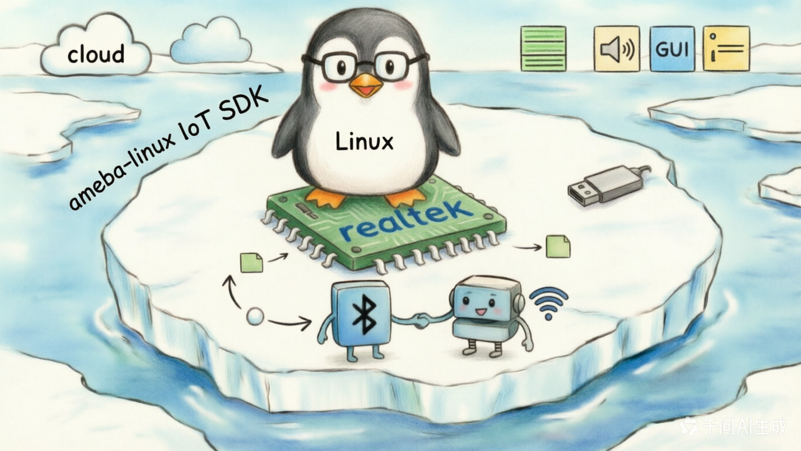

<div align="center">



# development

**Linux-side user-space applications, daemons, tools, and pre-built assets for the ameba-linux IoT SDK.**

[](https://aiot.realmcu.com/en/latest/linux/index.html)
[](#)
[](#)

[English](README.md) · [中文版](README_CN.md) · [Linux SDK Docs](https://aiot.realmcu.com/en/latest/linux/index.html)

</div>

`development/` collects the Realtek-authored **user-space software** that runs on top of the Ameba Linux kernel: command-line tools, daemons, control-plane utilities, connectivity helpers, an AI runtime, MP (mass-production) tools, and pre-built assets. Each subdirectory is a standalone software package with its own `Makefile`, and is packaged into the final image by Yocto recipes under [`meta-realtek/meta-realtek-bsp/recipes-development/`](../yocto/meta-realtek/meta-realtek-bsp/recipes-development) or [`meta-realtek/meta-sdk/recipes-rtk/`](../yocto/meta-realtek/meta-sdk/recipes-rtk).

## 🧭 Position in the SDK

```text
┌──────────────────────────────────────────────────────────────┐
│  development/  ← user-space apps, daemons, MP tools          │
│      adbd  rtwpriv  hciattach  recoveryd  aivoice  tflite …  │
├──────────────────────────────────────────────────────────────┤
│  Linux 6.18 kernel + drivers  (sources/kernel/)              │
├──────────────────────────────────────────────────────────────┤
│  Co-processor firmware  (sources/firmware/)                  │
├──────────────────────────────────────────────────────────────┤
│  Realtek Ameba SoC                                           │
└──────────────────────────────────────────────────────────────┘
```

## 🏗️ Directory layout

```text
development/
├── adb/            # Android Debug Bridge — host-side adb + device-side adbd (USB / TCP debug)
│   ├── adb/            #   adb client (host)
│   ├── adbd/           #   adbd device daemon
│   ├── libcutils/      #   Android bionic cutils port
│   ├── libmincrypt/    #   RSA signature verification
│   └── adb_usb.sh      #   USB gadget bring-up script
│
├── apps/           # Upper-layer applications
│   ├── aivoice/        #   AI voice application (KWS, ASR, AFE) — Realtek offline voice stack
│   └── pangu_app/      #   Pangu pre-built application package
│
├── bluetooth/      # Bluetooth user space
│   ├── bt_fw/          #   BT firmware & configurations (rtl8730_fw, mp_fw, LE-Audio-disabled, BR/EDR-disabled …)
│   ├── hciattach/      #   HCI attach daemon (H4, Realtek proprietary download v2/v3)
│   └── rtlbtmp/        #   Realtek Bluetooth MP / RF-test tool
│
├── cmds/           # Small hardware-control utilities
│   ├── captouch/       #   Cap-touch controller CLI
│   ├── efuse/          #   eFuse read / burn CLI
│   ├── getevent/       #   Android-style input event dumper
│   ├── km4_console/    #   Console into the KM4 co-processor via IPC
│   └── otp-ipc/        #   OTP access via IPC
│
├── openthread/     # Thread / 802.15.4 support
│   ├── 8771HTV/                                #   RCP / NCP firmware for RTL8771
│   └── RTKRCP_Config_CFU_Tool_V1.02_20241218/  #   Configuration & CFU tool
│
├── recovery/       # Recovery / OTA update infrastructure
│   ├── recovery.c              #   Recovery main program
│   ├── recoveryd/              #   Persistent recovery daemon
│   ├── install.c               #   Update-package install logic
│   ├── config_parser.c         #   flash_image.cfg parser
│   ├── flash_image.cfg         #   Partition / image layout configuration
│   └── storage_mount/          #   Storage-mount helper
│
├── tflite/         # TensorFlow Lite (LiteRT) Ameba runtime
│   ├── lib/            #   aarch64 pre-built TFLite libraries
│   ├── inc/            #   Public headers
│   ├── examples/       #   `minimal` and `label_image` demos
│   ├── bin/            #   Reference binaries
│   ├── patch/          #   Local patches on top of TF v2.18.0
│   └── build/          #   Build helpers
│
└── wifi/           # Wi-Fi user space
    ├── ATWZ/               #   AT-command-style Wi-Fi test tool
    ├── rtwperf/            #   Realtek Wi-Fi throughput / performance tester
    ├── rtwpriv/            #   Realtek proprietary-ioctl CLI (`iwpriv` style)
    └── wireless-regdb/     #   Wireless regulatory database
```

## ✨ Highlights

- **adb** — complete ADB debug channel (host `adb` + device `adbd`), can run over USB gadget or TCP.
- **AI Voice** — Realtek offline voice stack (AFE + KWS + VAD + ASR), see [`apps/aivoice/README.md`](apps/aivoice/README.md).
- **TFLite** — LiteRT v2.18.0 port for Ameba, with a minimal demo and an image-classification demo; see [`tflite/README.md`](tflite/README.md).
- **Bluetooth MP** — firmware binaries + `hciattach` with Realtek HCI download v2/v3 support, including LE-Audio- and BR/EDR-disabled variants and the `rtlbtmp` RF-test tool.
- **Wi-Fi tooling** — `rtwpriv` (proprietary ioctl), `rtwperf` (throughput), `ATWZ` (AT-style Wi-Fi test), and the wireless regulatory database.
- **Recovery** — self-contained recovery + OTA installer with a persistent `recoveryd` daemon and a configurable partition layout.
- **Co-processor bridge** — `km4_console` and `otp-ipc` expose the KM4 side (running the [`firmware/`](../firmware) image) to Linux user space over IPC.
- **OpenThread** — RCP firmware and configuration tool for the RTL8771 802.15.4 combo.

## 🚀 Build

Each subdirectory is a plain `Makefile` project, built via the usual Yocto path. From the SDK root (`6.18.y/`):

```bash
# Enter the build environment
source envsetup.sh -m rtl8730elm-va8 -d ameba-full

# Build the full image (includes everything under development/)
m

# Build a single package only (e.g. adbd)
bitbake -c cleanall adbd
bitbake adbd
```

Cross-compiling a single package outside the Yocto environment:

```bash
cd sources/development/<package>
make CROSS_COMPILE=<your-cross-prefix>-
```

The package-to-recipe mapping lives in [`sources/yocto/meta-realtek/meta-realtek-bsp/recipes-development/`](../yocto/meta-realtek/meta-realtek-bsp/recipes-development) (BSP components) and [`meta-sdk/recipes-rtk/`](../yocto/meta-realtek/meta-sdk/recipes-rtk) (upper-layer apps such as `aivoice`, `tflite`, `recoveryd`).

## 📚 Documentation

- **Ameba Linux SDK User Guide** — https://aiot.realmcu.com/en/latest/linux/index.html
- **AIVoice** — https://aiot.realmcu.com/en/latest/rtos/ai/aivoice/aivoice_overview/index.html
- **TFLite on Ameba** — https://aiot.realmcu.com/en/latest/linux/ai/tfl/index.html

## 💬 Feedback

Community: [Real-AIOT Forum](https://forum.real-aiot.com/)
